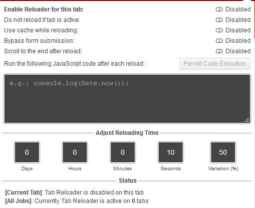
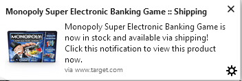

# Web Desktop Notifier
#### Javascript snippets for auto reload browser add-ons

This is a library of javascript snippets that can be used with various [auto refresh browser add-ons](https://www.reddit.com/r/chrome/comments/8u89am/safe_and_reliable_auto_refresh/) in most modern browsers (quit using IE, please for all us). These scripts reference various HTML elements on the given store's product page and reports back via desktop notifications on product stock status.

**My Suggestions on Add-Ons**

_!! Tab Reloader !!_
[Chrome](https://chrome.google.com/webstore/detail/tab-reloader-page-auto-re/dejobinhdiimklegodgbmbifijpppopn?hl=en)
[Firefox](https://addons.mozilla.org/en-US/firefox/addon/tab-reloader/)
[Opera](https://addons.opera.com/en/extensions/details/tab-reloader/)
[Edge](https://microsoftedge.microsoft.com/addons/detail/tab-reloader-page-auto-r/amclpbiglkmdhodbgnchnkmfdghnabik)

**How to Use These Scripts**

I suggest using these settings for Tab Reloader:



```
NOTE: click `Permit Code Execution` to give Tab Reloader permission to run javascript code after reloading a tab
```

* Find the javascript snippet for the website you're using and paste the contents of the file into the black text box
* Turn on the reloader by flipping the top switch and you're ready!

```
NOTE: Make sure, when prompted, to give the tab permissions to send desktop notifications
```

**Example Notification**



---

 [@dasginger](https://twitter.com/DasGinger) |  [My Code](https://github.com/DasGinger) | [:: email me ::](mailto:jcweber90@gmail.com)